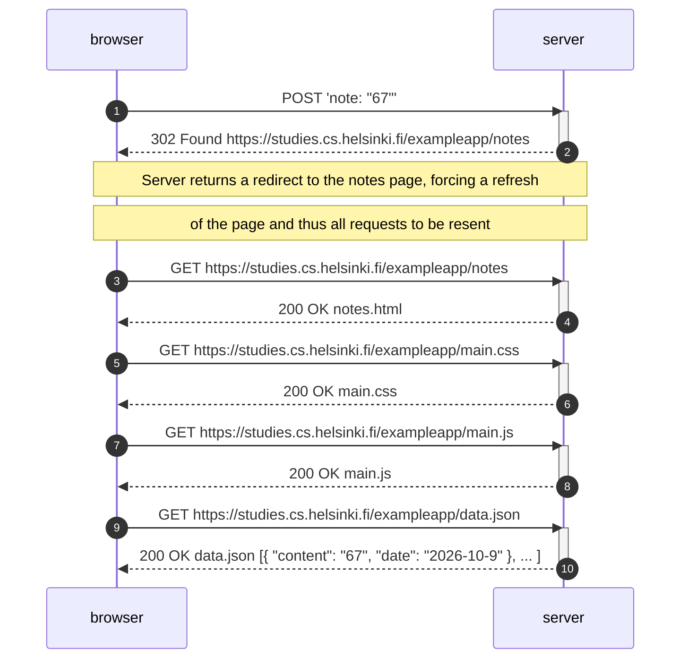

```mermaid
sequenceDiagram
    participant browser
    participant server
	autonumber

    browser->>server: POST 'note: "67"'
    activate server
    server-->>browser: 302 Found https://studies.cs.helsinki.fi/exampleapp/notes
    deactivate server

    Note over browser, server: Server returns a redirect to the notes page, forcing a refresh
    Note over browser, server:  of the page and thus all requests to be resent

    browser->>server: GET https://studies.cs.helsinki.fi/exampleapp/notes
    activate server
    server-->>browser: 200 OK notes.html
    deactivate server

    browser->>server: GET https://studies.cs.helsinki.fi/exampleapp/main.css
    activate server
    server-->>browser: 200 OK main.css
    deactivate server

    browser->>server: GET https://studies.cs.helsinki.fi/exampleapp/main.js
    activate server
    server-->>browser: 200 OK main.js
    deactivate server

    browser->>server: GET https://studies.cs.helsinki.fi/exampleapp/data.json
    activate server
    server-->>browser: 200 OK data.json [{ "content": "67", "date": "2026-10-9" }, ... ]
    deactivate server
```