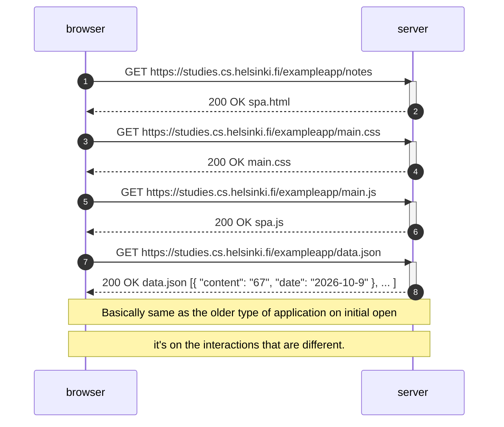

```mermaid
sequenceDiagram
    participant browser
    participant server
    autonumber

    browser->>server: GET https://studies.cs.helsinki.fi/exampleapp/notes
    activate server
    server-->>browser: 200 OK spa.html
    deactivate server

    browser->>server: GET https://studies.cs.helsinki.fi/exampleapp/main.css
    activate server
    server-->>browser: 200 OK main.css
    deactivate server

    browser->>server: GET https://studies.cs.helsinki.fi/exampleapp/main.js
    activate server
    server-->>browser: 200 OK spa.js
    deactivate server

    browser->>server: GET https://studies.cs.helsinki.fi/exampleapp/data.json
    activate server
    server-->>browser: 200 OK data.json [{ "content": "67", "date": "2026-10-9" }, ... ]
    deactivate server

    Note over browser, server: Basically same as the older type of application on initial open
    Note over browser, server: it's on the interactions that are different.
```